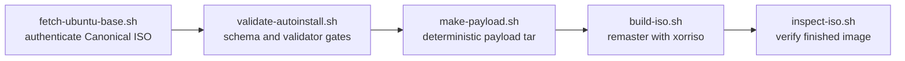
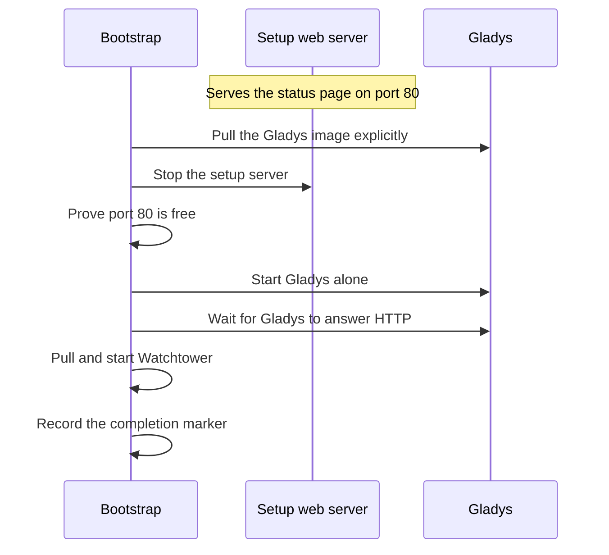

# Architecture

This document describes how the ISO is produced, what the installed appliance looks like, and how first boot provisions Gladys. The security rationale behind these choices is in [SECURITY.md](SECURITY.md).

## Build pipeline

The build is a chain of five scripts. Each stage authenticates or validates its inputs before the next stage may run, and the finished image is inspected against the authenticated base before it is accepted.



1. `fetch-ubuntu-base.sh` authenticates Canonical's archive keyring, the signed `SHA256SUMS` document, the selected Ubuntu 26.04 amd64 live-server ISO name, and the ISO bytes themselves. It always selects the newest 26.04 point release and re-verifies cached downloads.
2. `validate-autoinstall.sh` extracts the actual source catalog and Autoinstall schema from that verified ISO, enforces exactly one minimized server source, and runs the Canonical Subiquity 26.04 validator pinned to a full commit SHA.
3. `make-payload.sh` builds a deterministic, numeric-root tar archive from `payload/` inside a temporary tree and injects the independent installer `VERSION`. Only the `ci-smoke` profile receives test fixtures, including a deterministic Debian package whose blocking `postinst` makes dpkg power loss recovery observable in tests.
4. `build-iso.sh` syntax-checks GRUB, replaces the single unambiguous Canonical installer stanza with the **Install Gladys Assistant** stanza, adds only the `autoinstall` kernel argument, selects the entry by default behind a visible three second timeout, repairs the affected media checksum, maps the selected Autoinstall document and payload files into the image with xorriso, and replays the original boot equipment unchanged.
5. `inspect-iso.sh` re-extracts the finished image, checks the embedded hashes, profile, and GRUB structure, compares the signed boot chain files and El Torito metadata against the base ISO, and rejects any production payload contamination.

The Ubuntu shim, GRUB EFI binaries, kernel, initrd, EFI partition, and media integrity mechanism all remain Canonical's. The custom ISO changes configuration and adds a separately hashed target payload; it never rebuilds the boot chain.

## Installed appliance

Subiquity installs a normal Ubuntu Server target from the minimized source. Production media present the locale, keyboard, storage, identity, and SSH screens in the normal installer order, with French locale and French AZERTY keyboard preselected and the OpenSSH server off by default; the CI Autoinstall document replaces that interactivity with an explicitly accountless pin. The result is deliberately spartan:

- Timezone is UTC and the hostname is `gladys`.
- The operator creates their own administrator account on the identity screen and decides on the SSH screen whether the OpenSSH server is installed. Root stays locked and the ISO embeds no account or password.
- Only security updates are enabled; automatic reboot and release upgrades are disabled.

Autoinstall late commands verify the payload SHA256 before extraction, extract it into the target with numeric ownership, enforce root ownership and explicit permissions, install the version file, enable the three Gladys systemd units, and mask the tty1 getty so the status console owns that terminal.

The three units are:

| Unit | Role |
| --- | --- |
| `gladys-firstboot.service` | Runs the provisioning bootstrap once, as root, until completion |
| `gladys-setup-web.service` | Serves the setup status page on port 80 until Gladys takes over |
| `gladys-console.service` | Renders localized phase progress and the LAN IPv4 address on tty1 |

## First boot state machine

`gladys-firstboot.service` owns provisioning under an exclusive process lock. The only skip condition is the completion marker `/var/lib/gladys-installer/completed`; the sibling `/var/lib/gladys-installer/state.json` exists solely for presentation and is never trusted for decisions. Both files are replaced atomically after syncing the file content and the containing directory, so a power cut cannot leave a half-written state.

The explicit phases are:

```text
PREFLIGHT > WAIT_NETWORK > APT_UPDATE > INSTALL_PACKAGES
  > START_SYSTEM_SERVICES > DOCKER_PREFLIGHT > PULL_GLADYS
  > START_GLADYS > VERIFY_GLADYS > START_WATCHTOWER
  > FINALIZE > READY
```

plus a terminal `FATAL` phase for deterministic configuration failures. Every operation is idempotent and reruns safely after an interruption. Transient network, APT, registry, or readiness failures retry with capped backoff; deterministic configuration failures stop the service with exit code 78, which systemd is configured not to restart.

First boot installs `docker.io`, `docker-compose-v2`, unattended upgrades tooling, CA certificates, and curl through non-interactive Ubuntu APT. Before pulling any application it verifies the package candidates, the system services, the Docker CLI, Compose, and the resolved Compose model.

Each phase is described from an operator's point of view in [OPERATIONS.md](OPERATIONS.md).

## Port 80 handoff

The setup page and Gladys both want port 80, so the bootstrap performs an explicit, verified handoff:



`gladys-setup-web.service` starts only while the completion marker is absent. It runs as a systemd dynamic user with heavy sandboxing, holds only the port binding capability, embeds its assets in memory, and exposes exactly three paths: `/`, `/status.json`, and `/healthz`.

Gladys must be running and answering HTTP before Watchtower is pulled and started. If a readiness attempt fails, the application is stopped and the setup page is restored where possible, so the user is never left staring at a dead port. Completion is recorded only after the Docker, Compose, application HTTP, and Watchtower checks have all succeeded.

## Container and update boundaries

The production Compose contract runs `gladysassistant/gladys:v5` privileged, with host networking, host cgroup access, the Docker socket, `/dev`, read-only udev events, and persistent application data at `/var/lib/gladysassistant`. These broad privileges are confined to Gladys because its hardware integration architecture requires them; the consequence for the threat model is spelled out in [SECURITY.md](SECURITY.md). Watchtower uses the Docker socket only to update the moving Gladys channel and to clean replaced images.

Ubuntu security updates are a separate boundary managed by `unattended-upgrades`. Automatic reboot and Ubuntu release upgrades are disabled. Rebuilding this installer updates installer logic or the authenticated Ubuntu base; it is never required for ordinary Gladys v5 updates.

## Discovery and user interfaces

During provisioning, the tty1 console publishes the current IPv4 address of the setup page. Once Gladys is ready, Gladys itself advertises `gladysassistant.local` through its integrated mDNS support; the installer does not run a second mDNS daemon. The console keeps showing the LAN IPv4 addresses as a fallback, so neither a graphical stack nor a maintenance login is ever required.

The selected Subiquity locale is read from `/etc/default/locale`. A shared, embedded catalogue translates the browser setup page into every language offered by the pinned Subiquity 26.04 language list, with an explicit English fallback for malformed or unknown locale values. tty1 uses the selected translation for scripts the Linux virtual console can render; Arabic, Hebrew, Tibetan, Japanese, and Chinese fall back to readable English copy there because the kernel console cannot provide the required shaping, bidirectional layout, or glyph coverage.

Both interfaces show coarse, truthful phase progress. Animated activity communicates that long package and container downloads are still running; the UI never invents byte counts it cannot know.
