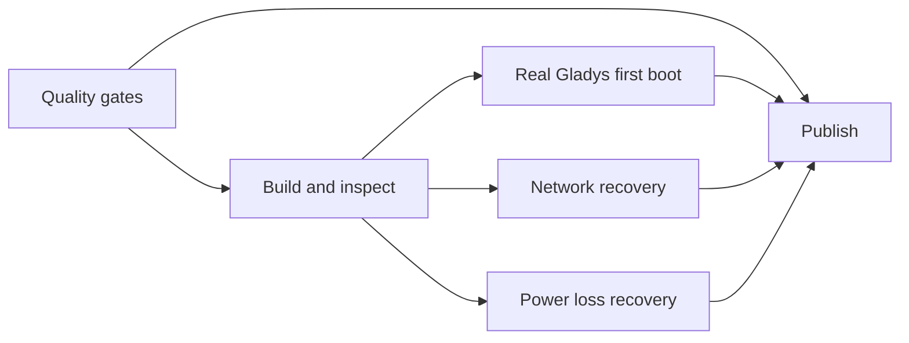

# Release procedure

Public releases are explicit version-tag operations. A successful weekly integration run never publishes media automatically.

## Prepare

1. Confirm the intended installer version is exactly the semantic version in `VERSION`. Gladys has an independent moving `v5` channel and must never appear as a numbered release in any metadata.
2. Review dependency and pinned-action updates, the current Canonical 26.04 source discovery, and the latest scheduled real-Gladys results.
3. Run the static checks, the unit tests, all three profile builds, finished production inspection, a UEFI install, a real Gladys and Watchtower first boot, offline recovery, and forced power loss recovery.
4. Complete the applicable physical tests in [HARDWARE-TEST-CHECKLIST.md](HARDWARE-TEST-CHECKLIST.md). Never convert unchecked hardware into a support claim.
5. Create and push an annotated tag `vX.Y.Z` that exactly equals `VERSION`.

## Gates enforced by the workflow

The release workflow rejects non-semantic tags and any tag that does not match `VERSION`. Its publishing job cannot run unless every dependency has succeeded:



Only the publishing job receives write permissions; everything else runs with read-only repository access.

## Published artifacts

GitHub caps release assets at 2 GiB per file, which is below the size of the installer image, so the ISO is published as numbered parts. Exactly these files are attached to a release:

```text
gladys-assistant-installer-vX.Y.Z-amd64.iso.part1
gladys-assistant-installer-vX.Y.Z-amd64.iso.part2
gladys-assistant-installer-vX.Y.Z-amd64.iso.sha256
build-info.json
```

The SHA256 and the provenance attestation both cover the reassembled ISO, not the parts. `build-info.json` records the installer version, the full Git commit, the architecture, the Ubuntu series, the selected Ubuntu ISO filename and SHA256, and the UTC build timestamp. It contains no Gladys version. The publish job checks the `.sha256`, splits the verified ISO, creates GitHub artifact provenance for the whole image, and uses `gh release create --verify-tag`.

## Verifying a release as a user

Download every asset, reassemble the image, then verify the checksum from the containing directory:

```bash
cat gladys-assistant-installer-vX.Y.Z-amd64.iso.part* > gladys-assistant-installer-vX.Y.Z-amd64.iso
sha256sum -c gladys-assistant-installer-vX.Y.Z-amd64.iso.sha256
```

On Windows PowerShell, reassemble with:

```powershell
cmd /c copy /b "gladys-assistant-installer-vX.Y.Z-amd64.iso.part1"+"gladys-assistant-installer-vX.Y.Z-amd64.iso.part2" "gladys-assistant-installer-vX.Y.Z-amd64.iso"
```

For a public repository, verify GitHub provenance with an authenticated, current GitHub CLI:

```bash
gh attestation verify \
  gladys-assistant-installer-vX.Y.Z-amd64.iso \
  --repo OWNER/REPOSITORY
```

Both checks are required release evidence: the SHA256 detects byte changes, and the attestation binds the subject digest to the GitHub Actions build identity. Inspect `build-info.json` and confirm its `git_commit` matches the release tag before distributing the image further.

## Post-release

Flash the exact released ISO and repeat a physical UEFI and Ethernet installation on representative hardware. Record the results and limitations. Never silently replace assets on an existing tag: fixes require a new installer version and a new tag.
